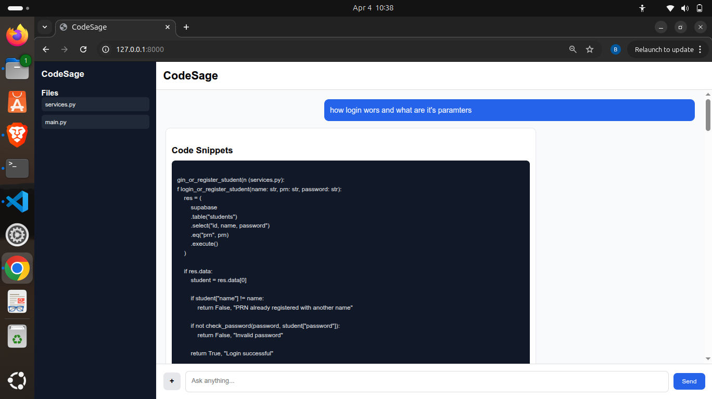

# CodeSage

CodeSage is an AI-powered codebase assistant that helps you understand, search, and analyze your code using natural language.

Upload your code files and ask questions — CodeSage will search relevant code snippets and generate intelligent explanations.

---

## 📸 Preview



---

# ✨ Features

- 🔍 Semantic Code Search
- 🤖 AI Code Explanation
- 📁 Multi-file Upload Support
- ⚡ Streaming AI Responses
- 🧠 Vector Search with ChromaDB
- 🌳 Code Parsing using Tree-sitter
- 💬 ChatGPT-like Interface
- 🔐 Environment-based API Key (.env)

---

# 🏗️ Project Structure
```bash
.
├── main.py
├── README.md
├── requirements.txt
└── templates
    └── index.html

```

---

# ⚙️ Installation

### 1. Clone Repository

```bash
git clone https://github.com/yourusername/codesage.git
cd codesage
```

### 2.Create Virtual Environment

```bash
python -m venv venv
source venv/bin/activate
(or Windows)
venv\Scripts\activate
```

### 3. Install Dependencies
```bash
pip install -r requirements.txt
```
### 🔑 Environment Variables

Create .env file:
```bash
API_KEY=your_groq_api_key
```
```bash
▶️ Run Server
uvicorn main:app --reload
```
Open browser:
```bash
http://127.0.0.1:8000

```
### 🧠 How It Works

1.Upload code files
2.Code is parsed using Tree-sitter
3.Code chunks converted to embeddings
4.Stored in ChromaDB
5.User asks question
6.Relevant code retrieved
7.AI generates explanation


### 🛠️ Tech Stack

- FastAPI
- Groq (Llama 3)
- ChromaDB
- Sentence Transformers
- Tree-sitter
- Jinja2
- HTML / CSS / JS


### 📸 UI Features

- Streaming AI responses
- Rolling typing indicator
- Sidebar file explorer
- Chat history

📌 Example Usage

Upload files:

main.py
services.py
auth.py

Ask:

How login flow works?

CodeSage will:

Find relevant functions
Show code snippets
Generate explanation
🔒 .gitignore

Project ignores:

.env
__pycache__
chroma_db
upload
virtual environments
🚀 Future Improvements
Folder upload
Code highlighting
Websocket streaming
Multi-project support
Code navigation

## 👨‍💻 **Author**

**Omkar Waghmare**  
Engineering in Computer Science | Aspiring Data Scientist